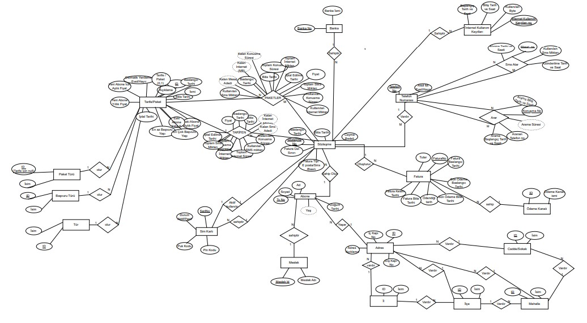

# Phone Operator Database

This project contains the database design for a phone operator and basic SQL queries.  

## Files
- **create.sql** – Script to create the database tables  
- **select.sql** – Sample queries on the tables  
- **VTS_G14_ER_2.pdf** – ER diagram and database design report  

## Usage
1. Run the `create.sql` file to create the tables.  
2. Test the queries using the `select.sql` file.  
3. For an overview of the database structure, see the `VTS_G14_ER_2.pdf` file.  

## Requirements
- Microsoft SQL Server or a similar SQL database system

## ER Diagram Preview

[See the detailed ER diagram in the PDF](VTS_G14_ER_2.pdf)

